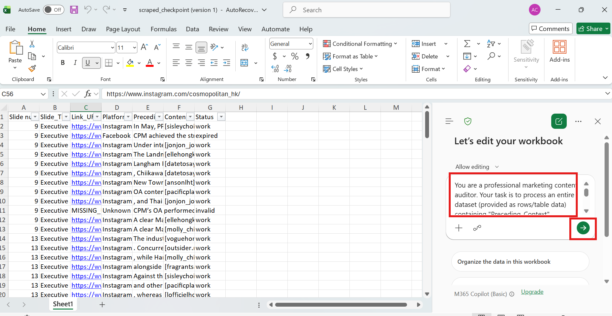

  <a href="README.zh.md">繁體中文</a>

# 🔗 Link Checker & AI Content Verifier

## 📌 1. What is this app?
This web application and repository are designed to automate presentation content auditing. 

**Main Purpose:**
*   **Upload PPT:** Input your PowerPoint file (.pptx).
*   **Extract Links:** Automatically scan and extract all hyperlinks embedded in the slides, along with their surrounding text context.
*   **AI Verification:** Use AI (DeepSeek / LLM / Excel Copilot) to compare the presentation context with the live scraped content from each link. It automatically checks whether the website content matches the PPT context, or if the link is expired/invalid.

---

## 🚀 2. How to Use

To run this application, you will need an **Apify** API token (to scrape web content) and an **LLM Provider** (or use Excel Copilot for the semantic check). 

### Step 1: Extract PPT Links
*   **Upload:** Upload your PowerPoint file (supports up to 200 MB). The app will automatically extract all internal hyperlinks and the surrounding text context.
*   **Review:** Once the extraction is complete, you can review the results table on the screen. If necessary, download the Excel file, edit it manually, and use it for the next steps.

### Step 2: API & Model Configuration
You must configure your Apify token and choose your AI verification method to proceed. 

**Part A: Get the Apify API Token (For Web Scraping)**
1.  **Register/Login:** Go to the [Apify Website](https://apify.com/) and create a new account or log in.
2.  **Settings:** Navigate to the **Settings** menu at the bottom of the left sidebar.
3.  **Integrations:** Click on the **Integrations** tab.
4.  **Copy Token:** Locate your **Personal API Token**. Click the "Copy" button.
5.  **Configure:** Paste this token into the `APIFY_API_TOKEN` field in the app. 
    *   *Note: Each Apify free account receives $5 USD in free usage credits every month.*

**Part B: Get the LLM API Key (Three Methods Available)**

**Method 1: Using DeepSeek (Paid per usage, highly affordable)**
1.  **Platform:** Go to the [DeepSeek Developer Platform](https://platform.deepseek.com/).
2.  **Login/Register:** Sign in with your email or Google account.
3.  **API Keys:** Navigate to the **API Keys** management page from the dashboard menu.
4.  **Create Key:** Click **Create new API key**, give it a recognizable name (e.g., `MyTestKey`), and confirm.
5.  **Save Key:** Copy the generated key (starting with `sk-`). *Save it immediately, as it will only be shown once.*
6.  **Top Up:** DeepSeek is a prepaid service. Go to the "Top Up" page and add a minimum of $2 USD. *(Estimated cost: ~ $0.10 USD per 120 links).*
7.  **Configure in App:**
    *   **Provider:** Select `DeepSeek`
    *   **API Key:** Paste your copied key.
    *   **Model Name:** Type `deepseek-v4-flash` (recommended).
    *   **Base URL:** Type `https://api.deepseek.com`

**Method 2: Using OpenRouter (Free tier available)**
1.  **Platform:** Go to the [OpenRouter Website](https://openrouter.ai/).
2.  **Login/Register:** Click **Sign In** or **Get Started** using Google, GitHub, or Email.
3.  **API Keys:** Navigate to the **API Keys** management page.
4.  **Create Key:** Click **Create Key**, name it, and confirm.
5.  **Save Key:** Copy the generated key (starting with `sk-or-v1-`). *Save it immediately in a secure place.*
6.  **Rate Limits:** 
    *   *Free Users:* Limited to checking **50 links per day**.
    *   *Paid Users:* If you top up $10 USD once, your free model rate limit is permanently increased to **1000 requests per day**. (Reference: [OpenRouter FAQ](https://openrouter.ai/docs/faq#how-are-rate-limits-calculated)).
7.  **Configure in App:**
    *   **Provider:** Select `OpenRouter`
    *   **API Key:** Paste your copied key.
    *   **Model Name:** Type `openrouter/free` (recommended for free usage).
    *   **Base URL:** Type `https://openrouter.ai/api/v1`

**Method 3: Free Method (Using Excel Copilot Directly)**
If you prefer not to use an API key for the AI verification step, you can use Excel's built-in Copilot feature later.
1.  **Select AI Provider:** You can choose any provider option in the app (e.g., DeepSeek) as a placeholder.
2.  **API Key / Model / Base URL:** You can simply type dummy or placeholder values (e.g., `XXX`) just to pass the configuration validation.
3.  **Bypass Web AI:** You will skip the automated web AI verification in Step 4 and instead perform the check directly inside your downloaded Excel file using Excel Copilot.

### Step 3: Scrape Web Content
*   **Input Data:** By default, the app will use the extracted links Excel file generated in **Step 1**. 
*   **Custom Upload:** Alternatively, you can uncheck the default option and upload a custom, edited Excel file. *(Note: The uploaded Excel file MUST contain a column named exactly `Link_URL`)*.
*   **Execute:** Click **Start Web Scraper** to begin fetching the live content from the target URLs. 
    *   *(Note: This process may take some time. If you see a "running person" icon in the top right corner of the screen, it indicates that the system is loading and processing normally in the background. It is not stuck or frozen, so please wait patiently.)*

### Step 4: AI Semantic Check (Two Ways)

**Option A: Automated Web AI Check**
*   **Input Data:** By default, the app uses the scraped checkpoint Excel file generated in **Step 3**.
*   **Prompt Engineering:** You can edit the AI Prompt in the provided text area to define exactly what constitutes a "match" or "mismatch".
*   **Execute:** Click **Start AI Verification** and download your final audited report.

**Option B: Free Method via Excel Copilot (Recommended for zero API cost)**
1.  Download and open your scraped Excel file generated from Step 3.
2.  Open the **Excel Copilot** logo/panel inside Excel.
3.  Copy the pre-written AI prompt by clicking on the **[Prompt File Link](./prompt.txt)** (or your prompt), and paste it directly into Excel Copilot.

4.  Let Copilot analyze your `Preceding_Context`, `Content`, and `Status` columns to automatically generate the `Result` and `Reason` columns for you for free!

### Step 5: Output Highlighted PPT
*   **Input Original PPT:** By default, the app reuses the original PowerPoint file you uploaded in Step 1. If the app's session memory has cleared (e.g., you refreshed the page), you can manually re-upload your `.pptx` file here.
*   **Input Audited Excel:** The app automatically uses the final AI-checked Excel report generated in Step 4. If you chose the free Excel Copilot method (Option B in Step 4) and bypassed the web AI, simply upload your manually completed Excel file. *Note: Your uploaded Excel must contain the exact column headers `Status` and `Result`.*
*   **Execute:** Click **Generate Highlighted PPT**. The system will match the audit results back to your slides and generate a new presentation with visually color-coded links (Green = Match, Red = Mismatch, Yellow = Broken/No Content).

---

## ⚠️ 3. Limitations & Platform Support
*   **General:** Cannot check links inside images or verify dynamic metrics (follower counts, dates).
*   **Supported (as of Aug 25, 2026):** Instagram, Threads, Xiaohongshu (XHS), WeChat, HK01.
*   **Not Supported:** Facebook, Douyin.
*   **Unstable:** Discuss.com, Weibo.

## 🔒 4. Privacy & Data Security
Your data privacy and security are strictly protected when using this application:
* **No Data Storage:** The developer does not save, collect, or monitor any of your inputs, including uploaded PPT files, generated Excel reports, or your personal API keys.
* **Session-Only Memory:** This app runs on Streamlit's ephemeral server. All your uploaded files and API keys are only kept temporarily in the server's memory while your browser tab is active. 
* **Auto-Clear:** Once you refresh the page or close your browser tab, everything is completely and permanently erased. You will need to re-enter your API keys the next time you open the app.

## 🚀 5. Planned Improvements & Ideas
* **1. Can hyperlinks embedded inside presentation tables also be extracted in Step 1?**
  * *Idea:* Explore upgrading the PPT extraction logic to scan and extract links hidden within tables, ensuring no references are missed.
* **2. Can more social platforms be supported for web content scraping in Step 3?**
  * *Idea:* Broaden scraping capabilities to cover a wider variety of platforms.
* **3. Can the output PPT make sure to achieve a 100% match with the audited Excel report in Step 5?**
* **4. Can all steps be combined into a single "one-click" workflow?**
  * *Idea:* Investigate merging the entire pipeline into a one-click process. While implementation is straightforward, thorough testing is required for each stage, and a unified solution would need secure backend database support to persistently manage user Apify and AI API keys.
