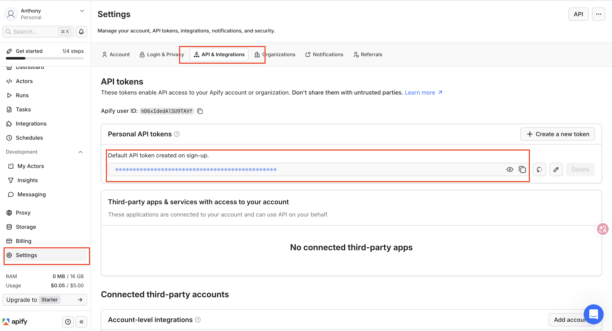
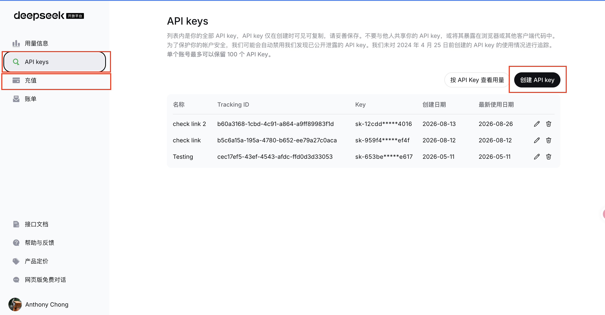
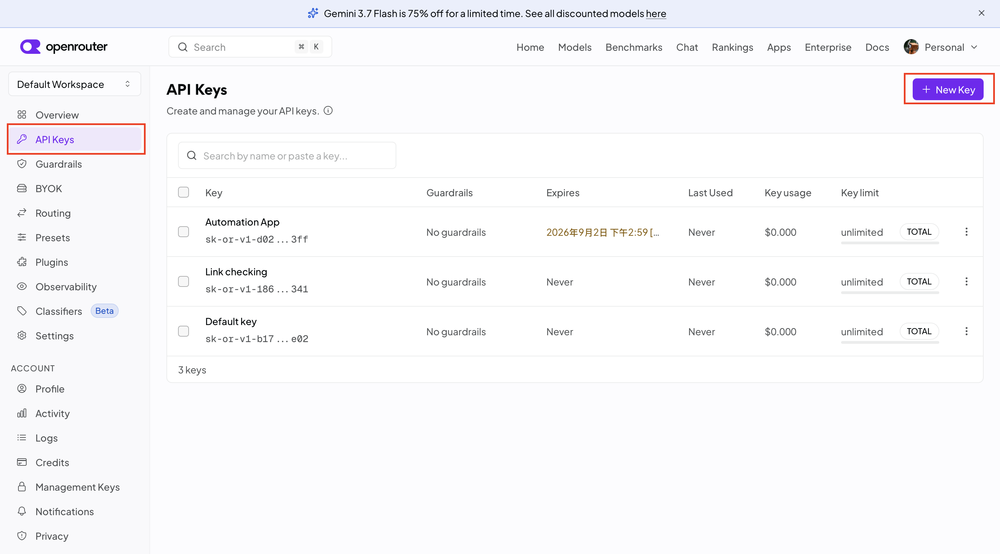
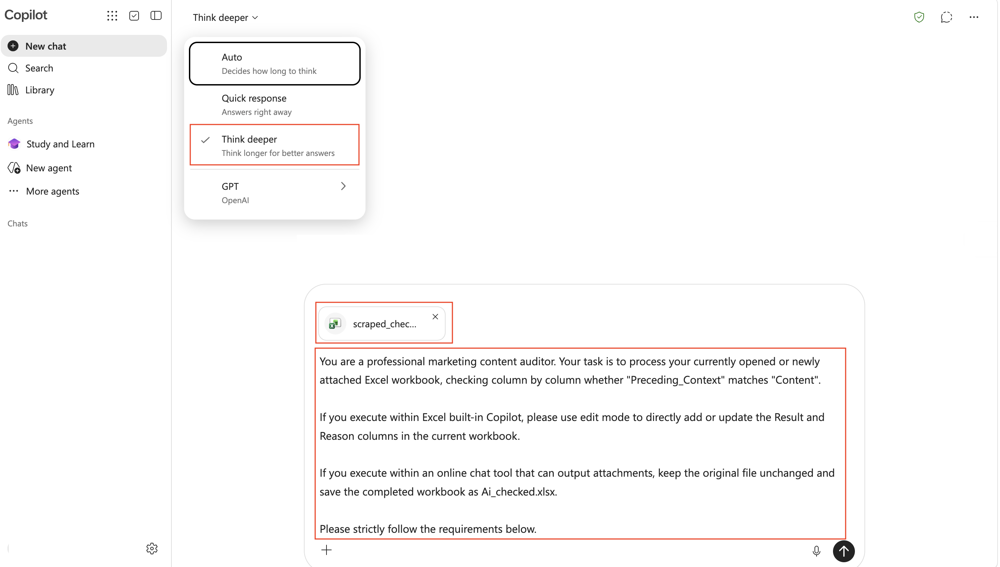

  <a href="README.md">English</a>

# 🔗 Link Checker & AI Content Verifier

## 1. 這是什麼應用程式？
這是一個專為自動化簡報內容審核而設計的網頁應用程式與程式庫。

> ⚠️ **重要聲明：** 請勿 100% 盲目信任 AI 輸出結果；使用者應確保各步驟的執行邏輯合理，並務必手動覆核關鍵數據與審核結果。本軟體依「現狀」提供，作者或版權持有人對任何索賠或損害均不承擔責任。

**主要功能：**
*   **上傳 PPT：** 匯入您的 PowerPoint 檔案 (.pptx)。
*   **萃取連結：** 自動掃描並提取投影片中嵌入的所有超連結及其前後文。
*   **AI 驗證：** 利用 AI (DeepSeek / LLM / Excel Copilot) 將簡報中的上下文與抓取到的網頁實際內容進行語意比對。它能自動檢查網頁內容是否與 PPT 上下文吻合，或判斷連結是否已失效。

---

## 2. 如何使用

要執行此應用程式，您需要準備 **Apify** API Token（負責網頁爬蟲），以及一組 **LLM 供應商**的金鑰（或透過 Copilot 進行語意檢核）。

### 步驟 1：萃取 PPT 連結 (Extract PPT Links)
*   **上傳檔案：** 上傳您的 PowerPoint 檔案（最高支援 200 MB）。系統會自動提取所有內部超連結及相關文字上下文。
*   **檢查與編輯：** 萃取完成後，您可以在畫面上預覽結果表格。如有需要，您可以下載 Excel 檔案進行手動編輯，再用於後續步驟。

### 步驟 2：API 與模型設定 (API & Model Configuration)
您必須設定 Apify Token 並選擇 AI 驗證方式才能繼續。

**第一部分：取得 Apify API Token (用於網頁爬蟲)**
1.  **註冊/登入：** 前往 [Apify 官方網站](https://apify.com/) 註冊一個新帳號並完成登入。
2.  **設定頁面：** 登入後，點擊左側選單底部的 **Settings（設定）**。
3.  **整合標籤：** 在設定頁面中，找到並點擊 **Integrations（整合）** 選項。
4.  **複製 Token：** 找到您的 **Personal API Token**。點擊右側的 "Copy" 按鈕進行複製。
5.  **輸入系統：** 將複製的 Token 貼到應用程式的 `APIFY_API_TOKEN` 欄位中。
    *   *註：每個 Apify 免費帳號每個月皆享有 $5 美元的免費額度。*

**第二部分：取得 LLM API 金鑰 (提供三種方法)**

**方式 1：使用 DeepSeek (依用量計費，極度平價)**
1.  **前往平台：** 打開瀏覽器，前往 [DeepSeek 開發者平台](https://platform.deepseek.com/)。
2.  **註冊/登入：** 使用電子信箱或 Google 帳號快速註冊並登入。
3.  **金鑰管理：** 進入開發者控制台後，點擊選單的 **API Keys**。
4.  **建立金鑰：** 點擊 **Create new API key**，為金鑰命名（例如 `MyTestKey`）後確認。
5.  **妥善保存：** 畫面會跳出一串以 `sk-` 開頭的金鑰。*請立刻複製並安全保存，因為它只會完整顯示這一次。*
6.  **帳戶儲值：** DeepSeek 採預付費制，請至 "Top Up"（儲值）頁面充值最低 $2 美元。*(預估成本：檢查 120 筆連結約只需 $0.10 美元)*。
7.  **在系統中設定：**
    *   **供應商：** 選擇 `DeepSeek`
    *   **API Key：** 貼上您剛複製的金鑰。
    *   **模型名稱 (Model Name)：** 輸入 `deepseek-v4-flash` (推薦)。
    *   **Base URL：** 輸入 `https://api.deepseek.com`

**方式 2：使用 OpenRouter (提供免費方案)**
1.  **前往平台：** 打開瀏覽器，前往 [OpenRouter 官方網站](https://openrouter.ai/)。
2.  **註冊/登入：** 點擊右上角的 **Sign In** 或 **Get Started**，使用 Google、GitHub 或 Email 快速登入。
3.  **金鑰管理：** 進入控制台的 **API Keys** 頁面。
4.  **建立金鑰：** 點擊 **Create Key**，命名後確認。
5.  **妥善保存：** 複製以 `sk-or-v1-` 開頭的金鑰。*請立即妥善保存於安全位置。*
6.  **速率限制：** 
    *   *免費帳戶：* 每天最多只能檢查 **50 筆連結**。
    *   *付費解鎖：* 若您一次性儲值 $10 美元，該帳號的免費模型額度將永久提升至 **每天 1000 筆請求**。(參考資料：[OpenRouter 常見問答](https://openrouter.ai/docs/faq#how-are-rate-limits-calculated))。
7.  **在系統中設定：**
    *   **供應商：** 選擇 `OpenRouter`
    *   **API Key：** 貼上您剛複製的金鑰。
    *   **模型名稱 (Model Name)：** 輸入 `openrouter/free` (免費推薦)。
    *   **Base URL：** 輸入 `https://openrouter.ai/api/v1`

**方式 3：免費方法（直接使用免費 AI 聊天室，例如 Copilot）**
如果您不想在 AI 驗證步驟中使用 API 金鑰，您可以稍後直接使用 Copilot 功能。
1. **選擇 AI 供應商：** 您可以在應用程式中隨意選擇任一供應商（例如 DeepSeek）作為佔位選項。
2. **API Key / Model / Base URL：** 您只需輸入虛擬值或佔位符（例如 `XXX`），即可通過設定驗證。
3. **略過網頁 AI：** 您將跳過步驟 4 中的自動化網頁 AI 驗證，改為在外部透過 Excel 與 Copilot 進行檢查。

### 步驟 3：爬取網頁內容 (Scrape Web Content)
*   **輸入資料：** 系統預設會直接使用 **步驟 1** 萃取出來的 Excel 檔案進行爬蟲。
*   **自訂上傳：** 您也可以取消勾選預設值，上傳自訂且手動編輯過的 Excel 檔案。*(注意：上傳的 Excel 檔案必須包含精確命名為 `Link_URL` 的欄位)*。
*   **執行：** 點擊 **Start Web Scraper**，開始抓取目標網址的實際內容。
    *   *(注意：爬取過程可能需要一些時間。若您看到畫面右上角出現「正在奔跑的小人」圖示，代表系統正在背景正常載入與執行中，並非當機卡住，請耐心等候。)*

### 步驟 4：AI 語意檢核 (兩種方式)

**選項 A：網頁自動化 AI 檢核 (付費)**
*   **輸入資料：** 系統預設會使用 **步驟 3** 產生的爬蟲結果 Excel 檔案。
*   **提示詞設定：** 您可以在文字框中編輯 AI Prompt，定義「相符 (match)」與「不符 (mismatch)」的標準。
*   **執行：** 點擊 **Start AI Verification** 並下載最終審核報告。

> **注意：** 您的自訂提示詞必須包含 `{context}` 與 `{content}` 變數標籤。在每次比對時，應用程式會自動將連結的前後文與爬取的文字填入這兩個變數中。若遺漏這些佔位符，AI 將無法接收到評估該連結所需的必要資料。

**選項 B：使用 AI 平台（如 Copilot）（免費）**
1.  **準備檔案：** 下載您在步驟 3 產出的爬蟲 Excel 檔案。
2.  **開啟 Copilot：** 前往 [Copilot 網頁版介面](https://copilot.microsoft.com/) 並選擇**深度思考（Deep Thinking）**模型。
3.  **上傳與輸入指令：** 將爬取好的 Excel 檔案上傳至聊天對話框中。點擊 **[提示詞檔案連結](./prompt.txt)** 複製預設的 AI 提示詞（或使用您的自訂提示詞），並直接貼入對話框。
4.  **生成結果：** 讓 Copilot 分析您的 `Preceding_Context`、`Content` 與 `Status` 欄位，自動為您生成 `Result`（結果）與 `Reason`（原因）欄位！

> **注意：** 不建議使用 Excel 內建的 Copilot 來執行此任務，因為它並非為長文本閱讀與深度語意推理而設計。

### 步驟 5：輸出高亮標註簡報 (Output Highlighted PPT)
*   **輸入原始 PPT：** 系統預設會自動帶入您在步驟 1 上傳的 PowerPoint 檔案。如果工作階段已被清除（例如重新整理過網頁），您可以手動在此處重新上傳 `.pptx` 檔案。
*   **輸入審核 Excel：** 系統會自動帶入步驟 4 產生的 AI 最終審核報告。如果您選擇免費的 Excel Copilot 方案（步驟 4 的選項 B）並跳過網頁 AI，請直接在此處上傳手動完成的 Excel 檔案。*注意：上傳的 Excel 必須包含精確命名的 `Status` 與 `Result` 欄位標題。*
*   **執行：** 點擊 **Generate Highlighted PPT**。系統會將審核結果對應回您的投影片，並產出一份將連結以色彩標註的全新簡報（綠色 = 相符，紅色 = 不符，黃色 = 連結失效 / 無內容）。

---

## 3. 限制與平台支援狀態
*   **通用限制：** 無法檢查圖片內嵌入的超連結。
*   **PPT 連結與前後文萃取限制：** 從 PowerPoint 簡報中萃取超連結及其前後文的功能並非 100% 完美。在某些特殊排版情境下（例如：複雜的群組物件、多層文字方塊或特定表格結構），系統可能無法成功擷取到前後文內容。
*   **Prompt 敏感度與 AI 幻覺：** 檢核結果（「相符 / Match」或「不符 / Mismatch」）的準確度高度取決於您所設計的 Prompt（提示詞）。系統提供的預設提示詞僅為方便參考的基準範本，無法保證在所有情境下皆 100% 判定正確；此外，輸出結果亦可能因大語言模型先天的「AI 幻覺」而產生誤差。
*   **支援平台（截至 2026 年 8 月 30 日）：** 
    *   Instagram (支援貼文內文、標題、作者/帳號名稱、發文日期擷取)
    *   Facebook (**僅支援 Reels 與影片內容**)
    *   Threads
    *   小紅書 (Xiaohongshu) (支援直接存取且無需掃描 QR code 的貼文)
*   **不支援平台：** 
    *   Facebook (一般貼文與限時動態)
    *   抖音 (Douyin)
*   **不穩定平台：** 香港討論區 (Discuss.com), 微博 (Weibo), 微信 (WeChat)

## 4. 隱私與資料安全聲明
在使用本應用程式時，您的資料隱私與安全將受到嚴格保護：
* **不儲存任何資料：** 開發者不會儲存、收集或監看您的任何輸入內容，包含上傳的 PPT 檔案、生成的 Excel 報告，以及您個人的 API 金鑰。
* **僅於工作階段 (Session) 暫存：** 本應用程式運行於 Streamlit 的暫時性伺服器。您的所有上傳檔案與金鑰僅會在瀏覽器分頁開啟時，暫存於伺服器記憶體中。
* **自動清除：** 只要您重新整理網頁或關閉瀏覽器分頁，所有內容都會被立即且永久地完全清除。下次開啟網頁時，您需要重新輸入 API 金鑰。

## 5. 計劃中的改進與構想
* **1. 步驟 3 是否能支援更多社群平台的網頁內容爬取？**
  * *構想：* 擴大爬蟲功能以涵蓋更多樣化的平台。
* **2. 是否能將所有步驟合併為單一的「一鍵完成」流程？**
  * *構想：* 探討將整個工作流程簡化為一鍵執行的可能性。雖然技術實作上很直覺，但每個階段都需要經過充分測試以確保品質，且整合型版本將需要安全的後端資料庫支援，來長期且安全地儲存使用者的 Apify 與 AI API 金鑰。